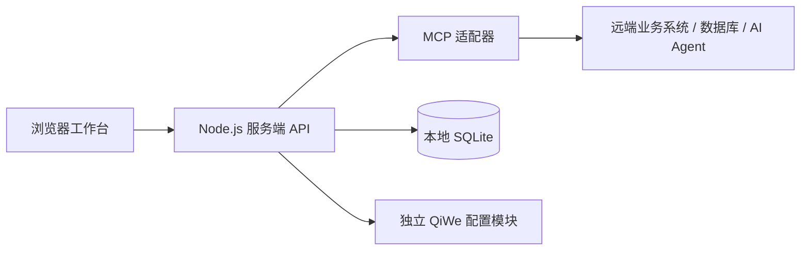

# BeeMax Serva

**AI Service Operations Platform · AI 服务运营平台**

BeeMax Serva 将 AI 智能分析、对话查询、服务工单和企微连接配置集中在一个工作台中。通过服务端 MCP 适配器连接已有业务系统与 AI Agent，支持查询、协作处理和周期性运营分析。

小组、人员和服务对象等内容由数据源提供，可用于采用相同服务协作模式的不同客户。仓库包含可运行的前后端应用及原始设计稿；当前业务适配器围绕工单模型实现，新的行业数据结构仍需字段映射。

## 功能

| 模块 | 当前能力 |
| --- | --- |
| AI 智能分析 | 自定义日期分析、异步任务状态、报告归档、建议跟进及报告追问 |
| 周期分析 | 日、周、半月、月、季、年及自定义间隔；分析频率与回顾范围独立设置 |
| AI 助手 | 对话查询、页面上下文、历史会话、Markdown 排版、消息时间与状态；浮窗支持放大与拖拽拉伸 |
| 运营总览与趋势 | 指标、趋势、全库统计及业务报表；支持筛选和每页 20 / 30 条记录 |
| 工单管理 | 搜索筛选、详情及中文流转时间线；催办、转派、挂起、恢复和完成 |
| 人员与配置 | 默认排班、今日当班、L1–L4 升级通知人员增删（默认 / 今日）、排班原文录入、路由规则、提醒参数、学习开关 |
| 企微账号与白名单 | 按实例管理群 / 人员授权、授权群推送开关；统一访问权限入口，明确 MCP 渠道级生效范围 |
| QiWe 凭据 | Token、Manager 账号与密码管理；敏感字段显示切换、留空保留旧值、服务端加密存储 |
| 消息日志 | 搜索、方向与类型筛选、详情及分页；真实消息待 QiWe 通道接入 |
| 自动同步 | 页面同步状态；每 5 分钟、10 分钟或自定义周期，保留筛选与编辑状态 |

业务写操作需要在界面确认，并由后端校验权限、参数和版本。MCP 模式可用动作取决于远端提供的工具及明确适配，具体见[功能映射](docs/mcp-integration.md#功能映射)。

## 快速开始

需要 **Node.js 24+** 和 npm。

```bash
git clone https://github.com/BeeMax-AI/BeeMax-Serva.git
cd BeeMax-Serva
npm ci
npm run build
npm start
```

打开 [本地工作台](http://127.0.0.1:8766)。未配置 MCP 时，默认使用本地样例数据。

### 首次登录

首次启动会在 `.local/access.json` 中生成账号及随机密码。请在服务所在机器上查看该文件，无固定通用密码。

| 初始账号 | 角色 | 说明 |
| --- | --- | --- |
| `admin` | 运营管理员 | 业务管理、企微账号和 QiWe 凭据编辑 |
| `owner` | 平台管理员 | 同一客户的平台管理及更高权限配置 |
| `viewer` | 只读用户 | 查看数据，无配置写权限 |
| `other` | 其他客户管理员 | 用于本地租户隔离验证 |

这些是全新数据目录的初始化账号，已有环境以自身配置为准。`.local/` 已被 Git 忽略，其中的账号密码、数据库、密钥和 MCP 连接配置不随仓库分发。

### 开发命令

```bash
npm run dev        # 首次构建前端，然后监控并重启后端
npm run build      # 前端变更后重新构建
npm run typecheck  # 前后端 TypeScript 检查
npm test           # 自动化测试
npm run check      # 类型检查、测试及前端构建
```

`dev` 不持续监控前端文件；修改前端后仍需运行 `npm run build`。测试使用临时数据库，不修改本地运行数据。

## 数据与 AI 接入



**MCP 模式**：业务数据通过 MCP 读取，支持的业务动作通过对应工具提交。AI 助手、手动分析和周期分析共用远端 MCP AI 通道。登录会话、报告、分析计划、对话及连接配置保存在工作台 SQLite 中。

**本地模式**：使用 SQLite 样例数据进行开发联调，保存的操作不会驱动真实工单引擎或发送企微消息。可另配兼容 OpenAI Chat Completions 的模型；未配置模型时，提供数据库查询、统计与明确标记的规则建议。

### 配置 MCP Server

创建 `.local/mcp-connection.json`，仅在服务端填写实际连接信息：

```json
{
  "url": "https://your-server.example/mcp?token=YOUR_TOKEN",
  "tenantId": "demo",
  "tenantName": "客户名称",
  "referenceLabel": "服务对象"
}
```

```bash
chmod 600 .local/mcp-connection.json
npm start
```

配置保存后重启服务。发现该文件时自动启用 MCP 模式；`tenantId` 必须与登录账号所属客户一致，示例 `demo` 对应初始化的 `admin`、`owner`、`viewer`。仅修改该字段不会创建或迁移用户。

当前实例配置一个 MCP 数据源。多客户连接不同数据源时，需要扩展服务端数据源注册与凭据映射。完整协议、工具映射和故障处理见 [MCP 接入文档](docs/mcp-integration.md)。

### 环境变量

参考 [.env.example](.env.example)。应用不会自动读取 `.env`，可显式加载：

```bash
cp .env.example .env
node --env-file=.env --import tsx server/src/index.ts
```

| 变量 | 用途 |
| --- | --- |
| `HOST` / `PORT` | 默认 `127.0.0.1` / `8766` |
| `DATA_DIR` | 本地持久化目录，默认 `.local` |
| `DATA_PROVIDER` | `local` 或 `mcp`；不指定时按 MCP 配置是否存在选择 |
| `MCP_CONFIG_FILE` | MCP 配置文件的自定义路径 |
| `AI_BASE_URL` / `AI_API_KEY` / `AI_MODEL` | 仅本地数据模式使用的可选模型配置；三项需齐备，URL 含 API 前缀，如 `https://gateway.example/v1/` |
| `APP_PUBLIC_URL` | 外部访问的准确 HTTPS 页面源 |
| `SESSION_SECURE` | HTTPS 部署设为 `true`，启用 Secure Cookie |

## QiWe 独立连接配置

在「设置 → QiWe 连接」中管理 Token、Manager 账号与密码。`admin` 和 `owner` 可保存，只读账号不能修改。凭据采用 AES-256-GCM 加密，接口与审计不返回已保存的明文；数据库和加密密钥分别存于 `.local/local.sqlite` 与 `.local/vault.key`。

企微账号、实例群 / 人员白名单、推送配置和 QiWe 凭据独立于业务 MCP 配置，即使 MCP 不可用也可管理。**当前已实现本地配置保存，尚未接入 QiWe 真实登录、在线检测、消息收发及推送执行**；保存成功不等于通道已连接，界面显示待连接、待同步或未验证。

### 白名单入口

进入「企微账号」，在账号列表下方直接使用白名单管理，选择管理实例后切换三个页签：

- **白名单授权**：分别管理群和人员，记录 ID、名称及加入时间，每页 20 / 30 条。
- **推送设置**：仅对已加入白名单的群开启或关闭主动推送。新群默认关闭推送，既有推送群保留原配置；移除群同时移除其推送配置。
- **访问权限**：保留 MCP 的渠道策略与名单操作，明确对整个企微或飞书渠道生效，不自动合并实例白名单。没有账号实例时，也可直接切换「访问权限」查看渠道设置。

群和人员的实例授权目前保存于本地，仍待通道接入后生效；MCP 渠道权限继续通过已有远端工具处理。配置管理中不再重复提供「群与权限」「推送群设置」。

## 项目结构

```text
client/                   前端界面、样式和交互
server/src/               HTTP API、持久层、业务与 MCP / AI 适配器
shared/                   领域类型、统计、分页和 Markdown 等共享逻辑
tests/                    API、权限、MCP、AI 与客户端状态回归测试
scripts/                  专项验证脚本
docs/                     接入契约、实现记录与问题复现说明
design/gongdan-dashboard/ 原始静态设计稿
```

前端采用 TypeScript 与浏览器 ES modules，后端采用 Node.js HTTP API 和内置 SQLite。前端构建产物位于 `client/dist/`。原设计稿的 `8765` 静态服务不由应用启动命令启动；应用默认运行在 `8766`。

## 运行边界

- 当前为单进程应用，尚未完成生产高可用、多节点会话、企业 SSO、账号管理及密码轮换能力。外部部署需配置 HTTPS 反向代理、`APP_PUBLIC_URL` 和 `SESSION_SECURE=true`；非本机监听会检查后两项。
- 周期分析依赖服务进程运行；停机恢复后，每个过期计划补一份到期报告，再安排下一次，不逐份补齐历史漏跑报告。
- 页面自动同步在页面打开且可见时执行，不改变后端报告计划；编辑或助手回复期间暂缓应用新数据。
- AI 助手的停止按钮停止浏览器等待，不保证远端模型任务取消；服务端可能继续完成并保存结果。
- 远端分析与查询结果受数据覆盖、统计口径及模型回答质量影响。已发现的相对日期查询差异见 [MCP AI 问题记录](docs/mcp-ai-upstream-issues.md)。
- 真实业务写入可能触发外部通知。已有自动化测试覆盖模拟服务行为，不能替代目标环境中的业务验收。

## 文档

- [MCP 接入、工具映射与 AI 通道](docs/mcp-integration.md)
- [实现范围与验收记录](docs/implementation.md)
- [远端 AI 回答问题复现](docs/mcp-ai-upstream-issues.md)
